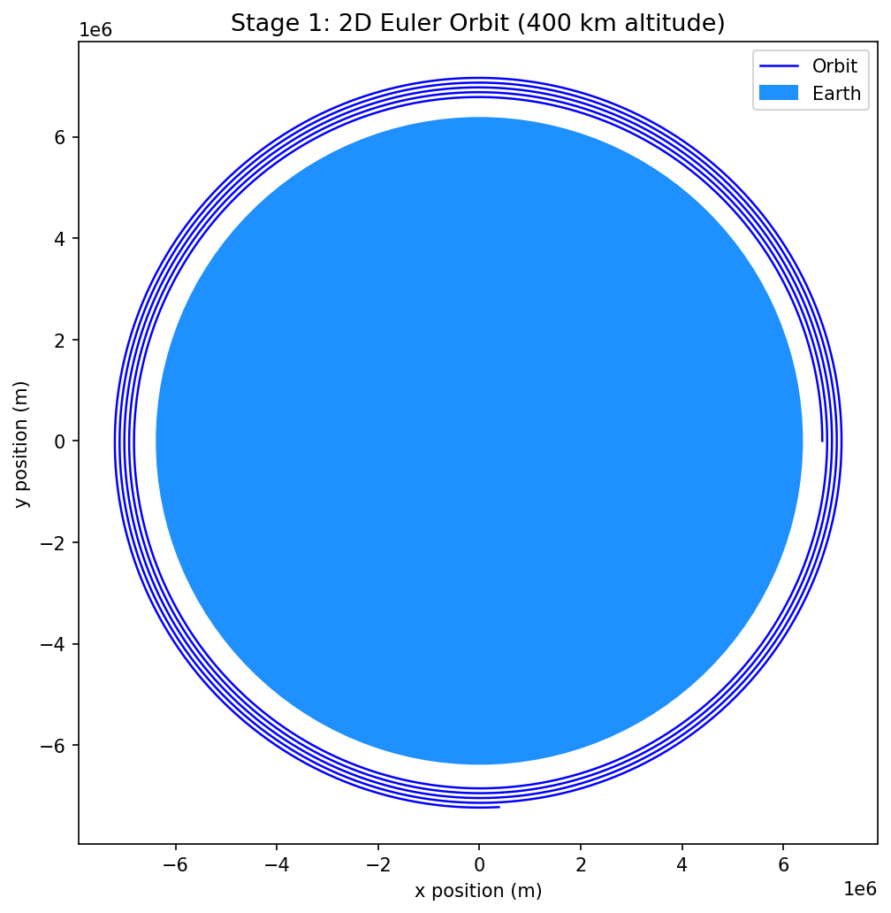
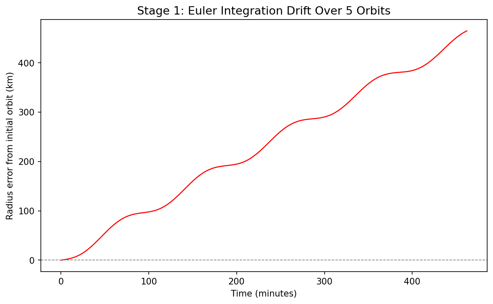

# Orbital Simulator: A Computational Model of Newtonian Orbital Mechanics

A Python orbital mechanics simulator built from first principles — Newtonian gravity, numerical integration, and physically verified orbital trajectories.

Validated against analytical results: gravitational acceleration at altitude and Kepler's Third Law orbital period.

*Built to be an independent and self-researched aerospace lab.*



**Author: Yashaswi Burugupalli**

---

## Why This Exists


I started this project to learn how mathematics can be used to build a visual representation of the path of a spacecraft travelling between planets. As an international student on a dependent visa without work authorization and ineligible to take paid internship or paid research positions, I decided if I could not work inside an aerospace lab, I could build one.

---

## Project Roadmap

The simulator is structured in six sequential stages:

```
Stage 1 --> Stage 2 --> Stage 3 --> Stage 4 --> Stage 5 --> Stage 6
[Euler]   [RK4/Energy]  [3D/Missions] [Polish] [J2 Modelling] [Lambert]
```

---

### Stage 1: 2D Newtonian Gravity and Euler Integration
*Completed - June 2026*

The goal of Stage 1 was to build a simulation that produced a realistic orbit when implemented from first principles. The simulation models a satellite orbiting Earth at an altitude of 400 km, similar to the ISS, using Newtonian gravity and numerical time integration.

This simulation assumes:

- Earth is a stationary central body
- Gravity follows Newton's inverse-square law
- Atmospheric drag is neglected
- The orbit begins as a circular low Earth orbit

The satellite's acceleration is computed using:

```
a = -mu * r / |r|^3
```

where:

- `mu` is Earth's standard gravitational parameter (m³/s²)
- `r` is the position vector of the satellite (m)

A critical phenomenon I came across while calculating the physics is how the mass of the satellite cancels when I apply F = ma to Newton's law of gravitation. This derivation deepened my understanding and allowed me to truly understand why all objects experience the same gravitational acceleration regardless of mass — a result that can as a genuine surprise.

#### Validation

Before trusting the orbit visually, I checked the simulation against two analytical results: the expected gravitational acceleration at altitude, and the orbital period predicted by Kepler's Third Law at two different timesteps (`T = 2*pi*sqrt(r^3 / mu)`).

| Check | Expected (analytical) | Simulated | Error |
|---|---:|---:|---:|
| Gravitational acceleration at 400 km altitude | 8.6939 m/s² | 8.6939 m/s² | 0% |
| Kepler's Verification @ dt = 10.0s | 5,545 s (92.42 min) | 7937 s | 43.14% |
| Kepler's Verification @ dt = 1.0s | 5,545 s (92.42 min) | 5841.3 s | 5.34% |

Something that came as a shock to me was the extremely large orbital period with an error of 43.14% at my original dt = 10.0s timestep. Forward Euler's non-symplectic nature, resulting from position updating before velocity, causes systematic energy injection. The per-step error compounds so severely that the orbit inflates dramatically within a single period. After testing different values for dt, I found the value of dt = 1.0s returned an acceptable but still large 5.34% error.

#### Orbit Visualization


*Figure 1: A 2D orbit of a 400 km satellite under Newtonian gravity with Euler integration.*

The simulation successfully produced a closed orbital path initially with one iteration. However, when simulated over multiple orbital periods, I found that the orbit gradually expanded outward.

I learned this behavior was not caused by an error in the gravitational model but emerged from the numerical integration method itself.

#### Euler Drift


*Figure 2: A plot of the radius error from the initial circular radius over time, in kilometres and minutes, spanning five orbital periods.*

Over five orbital periods, the simulated orbit accumulated significant radial error. The spacecraft gradually gained orbital energy and spiraled away.

However, what intrigued me more was the shape of the drift when graphed. As can be seen in figure 2, the graph takes on a sinusoidal wave pattern on a persistent upward trend. Upon further research on this observation, I learned that this wave pattern reflects the non-uniform manner in which forward Euler's method injects artificial energy, transforming the initially circular path into an increasingly elliptical one. As a result of plotting the absolute difference between the current radius and the initial circular radius, this physical transformation manifested as an oscillation on the graph.

A fundamental limitation of Euler integration is its assumption that acceleration remains constant throughout each timestep. What I found most interesting was that a mathematically valid algorithm still produced a physically incorrect result.

Forward Euler structurally failed because it is a first-order, non-symplectic integrator. It fails to preserve the Hamiltonian structure of the orbital system. This shortcoming causes the injection of artificial specific orbital energy forcing the orbit to spiral outward.

---

### Stage 2: RK4 Integration & Energy Conservation

*In progress - June 2026*

Currently working to replace the forward Euler method with fourth-order Runge-Kutta (RK4) integration, add energy conservation tracking, and introduce the Earth-Moon system.

---

### Stage 3: 3D Orbital Mechanics & Mission Scenarios

*Planned - Fall 2026*

---

### Stage 4: Documentation and Polish

*Planned - October 2026*

---

### Stage 5: J2 Perturbation Modelling

*Planned - November 2026*

---

### Stage 6: Lambert's Problem

*Planned - December 2026*

---

## Tools & Dependencies

- **Python 3.13.9** - NumPy, Matplotlib
- **Anaconda** environment
- **VS Code**
